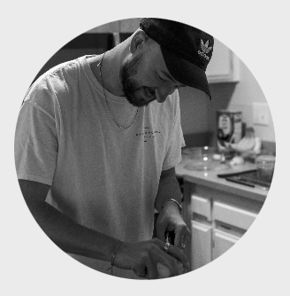
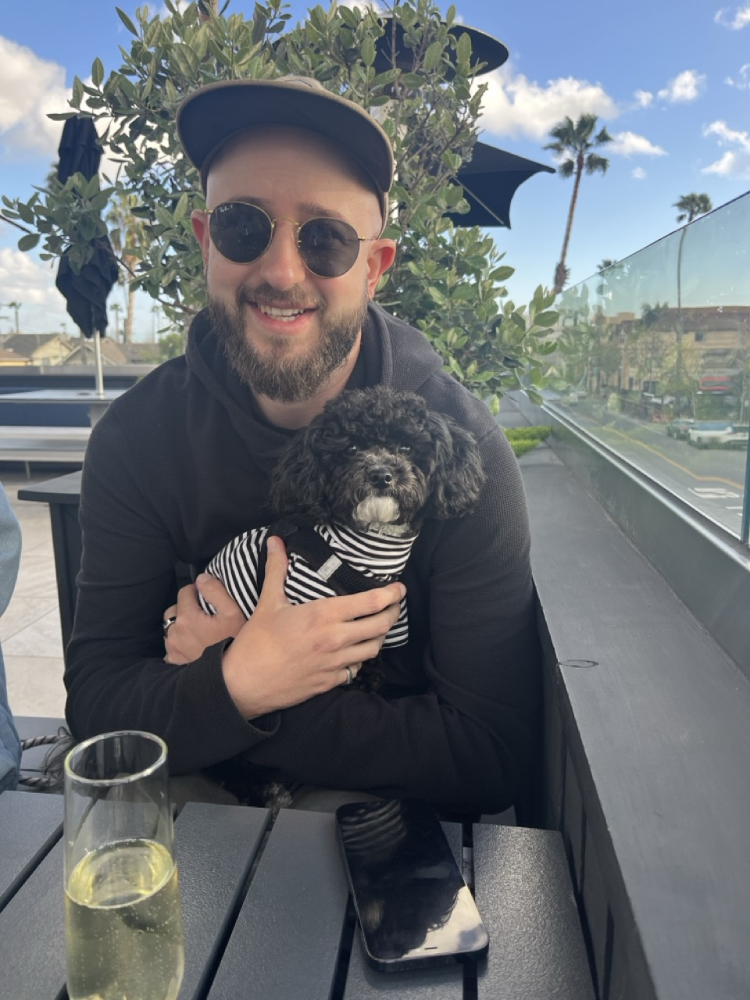
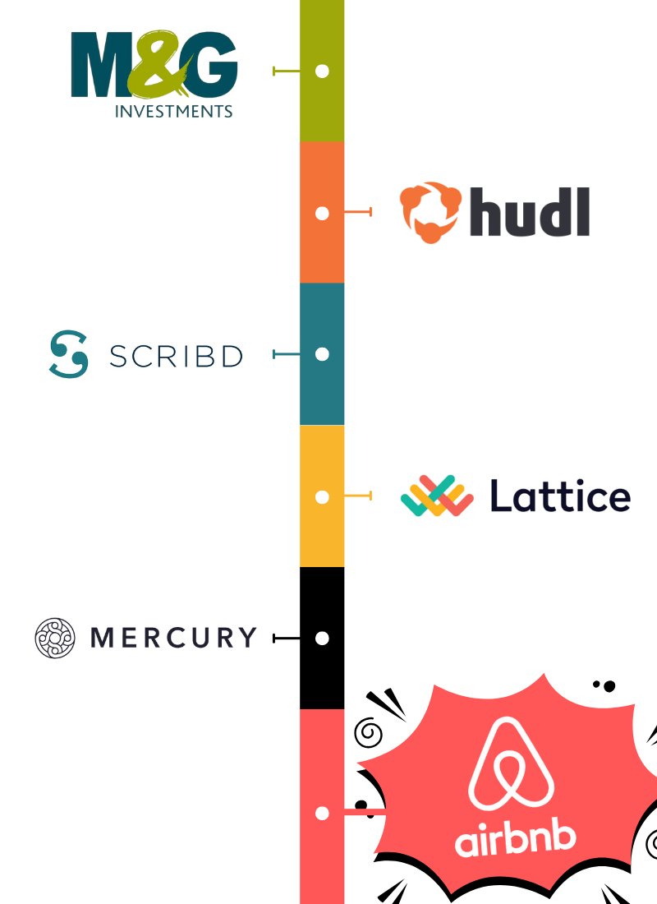

# README.jonny

Some bits of information about who I am, my values, how I work and how to work with me.

This is meant to be digested by people with whom I work closely, but in particular those who report to me.

---

<!-- footer: "If you need fish taco recommendations in San Diego, let me know!" -->

## About Me

- I live in **San Diego, California**, with my partner and her dog **Buffy**, a mini-poodle mix
- I have lived in the **UK** (Cambridge and London) and the **USA** (San Francisco, Oakland and Brooklyn)
- I love cooking, finding great places to eat, travel photography and learning new things!
  - Most recently, I've been learning about electrical codes in the USA (_real fun stuff..._)

---

<!-- footer: "" -->

## History

- I've been in Software Engineering for over 14 years
- I've worked as an Engineer and Engineering Manager in:
  - Finance & Fintech
  - Sports Video Analysis
  - E-Book & Audiobook SaaS
  - HR Tech

---

## Why Airbnb?

- The **People** and **Culture** are what brought me here
- The opportunity to work on impactful and innovative challenges in a dynamic environment
- The chance to grow and evolve alongside a passionate team and an industry-leading organization
- It's Airbnb!

---

## What is my job?

### Enabling delivery of high quality products and services for our customers

- help align, set direction and define what success and impact is
- relay and / or set context and expectations, whilst also removing obstacles
- ensure high level of efficiency, velocity and ease of use within the underlying infrastructure
- optimize against key metrics to measure and assure quality
  
  - (e.g. reliability, resilience, latency, maintainability)

### Inspiring talented people to do their best work by

- creating a high-degree of <a href="https://www.nytimes.com/2016/02/28/magazine/what-google-learned-from-its-quest-to-build-the-perfect-team.html" target="_blank">psychological safety</a>
- building a sense of belonging
- encouraging autonomy and engagement
- attracting, hiring, and retaining world-class talent

---

## How do I work?

### **_"What do I understand?"_**

- My strength comes from making sense of things
- I use facts and inferential thinking to "fill in the gaps"
- I like time to process, observe, ask questions and to think things through

### **_"Whom or what can I connect?"_**

- Having a sense of what could be, I get excitement about the combination of people, or of people plus technologies, projects and ideas
- I like to research data, technologies, and products – using these like raw materials that can be concocted into new teams, products and ideas

---

### Transparency

- I bias towards **transparency and openess**, which means you can expect candid and intentional communication from me
- However, there may be times when I am _not_ at liberty to be open or transparent
  - Even if I can't be transparent, I will not lie to you

### Communication

- I value **clear, honest and concise communication**, to ensure we are on the same page
- When communicating with me, it is always useful to make it clear if something is either:
  - **a notice**: bringing something to my attention and no action is required
  - **a request:** something you need my assistance with

---

## My (Working) Beliefs

**_You are better at your job than I am_**

- I will bring questions to the table, in order to build context and understanding

**_You are comfortable challenging my ideas and voicing disagreements_**

- The sooner we learn to navigate disagreements effectively, the sooner we’ll build mutual trust and respect

**_You have positive intentions_**

- Stressful moments can lead to tough discussions – I’ll do my best to stay objective and not take things personally

---

## Approach to Feedback

Feedback is a gift we should use mindfully to help others grow and improve. In order to do so we should provide feedback in a way that is:

- **Safe**: an environment where feedback can be shared openly, without fear of retaliation or negative consequences
- **Simple**: feedback is easy to deliver and received without rebuttals
- **Impactful**: it drives meaningful change, making the effort worthwhile

 

### I appreciate and value feedback on how well I'm enabling this approach

---

## 1:1s

When we work closely together we'll have regular 1:1s, likely every week

### For people reporting to me, the 1:1 is _your_ time

- I want to know what's on your mind:
  - What are your concerns, questions and thoughts?
- I want to avoid using your time for status updates
- I will assume that anything we discuss is confidential, unless otherwise disclosed

---

## Need my time?

- Ping me on Slack and ask for a quick chat
  - Maybe we can jump in a huddle or get something on the books
- Put something on my calendar - you don't need my permission
- Don't wait for a 1:1 if it's something tactical or urgent

---

## Some footnotes

- I bias towards action based on evidence
  - I try to steer away from too much debate around [type 2 decisions](https://kb.founderculture.net/public/posts/rmd3fjeg)
- **I am not perfect**, so please assume the best intentions, but don't hesitate to call out careless communication
  - If something I say is upsetting, please let me know and I'll do my best to understand, learn and fix it
- I ask **'why?'** a lot, and it might get annoying sometimes
  - It is only meant for me to build context and understanding
