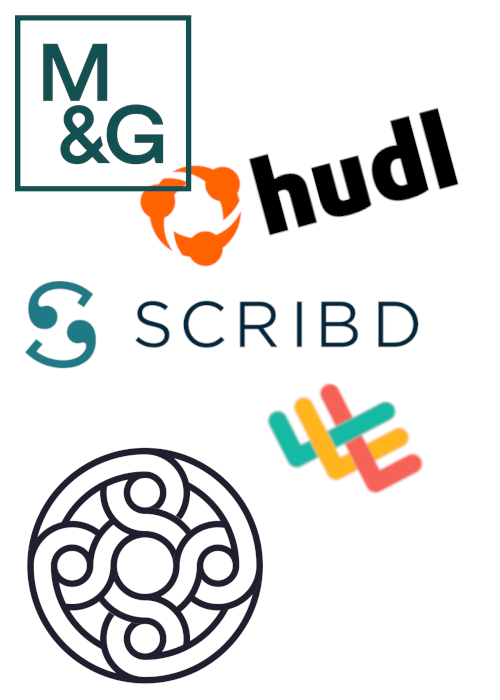

# README.jonny

Some bits of information about who I am, how I work and how to work with me

This is meant to be digested by people with whom I work closely, but in particular those who report to me

---

## Read this document to

- Familiarise yourself with me as a person
- Understand what you can (and can't) expect from me
- Get a sense of my values, particularly in a work context

---

## About Me

- I live in **San Diego, CA** and **Brooklyn, NY**
- I have lived in London, San Francisco and Oakland
- I'm British, but have been in the US since 2018
- I love cooking, eating, photography, travelling and exploring!

---

## History

- I've been in Software Engineering for over 10 years
- I've worked in:
  - Finance & Fintech
  - Sports Video Analysis
  - Ebook & Audiobook SaaS
  - HR Tech

---

## Why Mercury?

1. The **People** and **Culture** are what brought me here
2. The _huge_ business opportunity in front of us is hard to overstate
3. The opportunity to grow with a team, organization and company is what excites me

---

## My job is to

- attract, hire, and retain world-class talent
- create the context in which these talented people can do the best work which requires
  - a high-degree of [psychological safety](https://www.nytimes.com/2016/02/28/magazine/what-google-learned-from-its-quest-to-build-the-perfect-team.html)
  <!-- - people being engaged with the work, due to them
    - having a high degree of **autonomy**
    - having the opportunity for them to develop **mastery**
    - understanding the **purpose** of the work they do -->
- enable amazing products to be delivered autonomously, by
  - relaying and / or setting context
  - removing as many obstacles as I can

**PLEASE let me know** if this doesn't line-up with your day-to-day experience of working with me

---

## Transparency

- I am biased toward openness and transparency
- However, there may be times when I am _not_ at liberty to be open / transparent
- Even when I am constrained from full transparency, I am committed to _not_ lying to you.

---

## Communcation

- I prefer over-communication, and will default to this on the whole
- When communicating, it is always useful to let me know if something is either
  - something you're making me aware of, but requires no action on my part
  - something you need my assistance / help with, and what kind of urgency it is

---

## My assumptions

- **_You are better at your job than I am_**
  - I will bring questions to the table, in order to build context and understanding
- **_You feel safe disagreeing with and challenging me_**
  - The sooner we learn how to efficiently disagree with each other, the sooner we’ll trust and respect each other more
- **_You mean well_**
  - Stressful times yield stressful conversations. I'll do my best to not take things personally

---

## Approach to Feedback

- **Safety**: there should be no retaliation or punishment for giving feedback
- **Low Effort**: it should be easy to deliver, with no rebuttals
- **Positive Effect**: it should materially impact behaviour (i.e., be worth the effort)

**PLEASE** give me feedback on how well I'm delivering on these 3 dimensions.

---

## About 1:1s

If we work closely together, we'll have a regularly-occuring 1:1

### If I am your manager, the 1:1 is _your_ time:

- _Don't_ use the time for status updates if you can avoid it
- I will assume that anything we discuss is confidential, unless otherwise disclosed

---

## Need my time?

- Find me on Slack and ask for a quick chat; maybe we can do it _right now_. If not, let's schedule something.
- Put something on my calendar.  You don't need my permission.
- Don't wait for a 1:1, particularly if it's something tactical or urgent.

---

## Gotchas

- I bias towards action based on evidence
  - I try to steer away from too much debate around [type 2 decisions](https://kb.founderculture.net/public/posts/rmd3fjeg)
- Sometimes my mouth moves faster than my brain. As such:
  - Please assume the best of me, but ...
  - Don't let me off the hook for irresponsible (or worse) communication.
  - If something I say is upsetting, please let me know and I'll do my best to clean it up, as well as learn
